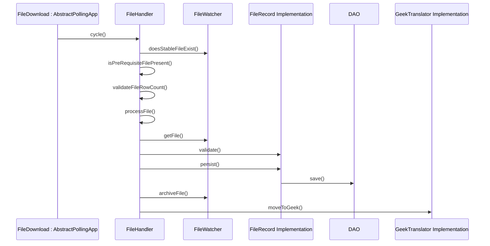

```mermaid
sequenceDiagram
    participant fd as FileDownload : AbstractPollingApp
    participant fh as FileHandler
    participant fw as FileWatcher
    participant fr as FileRecord Implementation
    participant d as DAO
    participant gt as GeekTranslator Implementation
    
    fd->>fh: cycle()
    
    fh->>fw: doesStableFileExist() 
    fh->>fh: isPreRequisiteFilePresent()
    fh->>fh: validateFileRowCount()
    fh->>fh: processFile()
    fh->>fw: getFile()
    fh->>fr: validate()
    fh->>fr: persist() 
    fr->>d: save()
    fh->>fw: archiveFile()
    fh->>gt: moveToGeek()
```